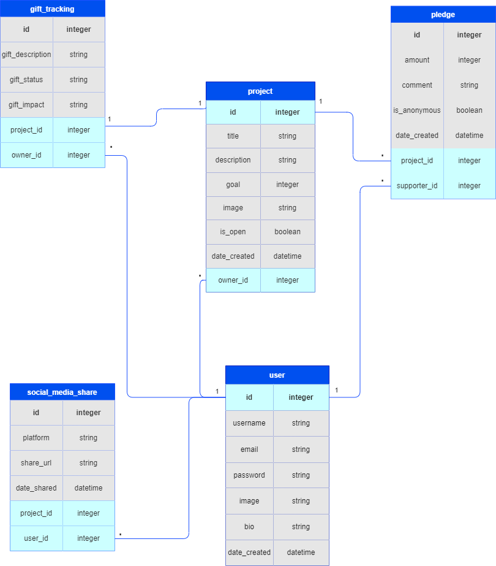

# crowdfunding_back_end

# WishFrog - Where Birthday Dreams Hop to Reality! 🐸🎂🌟

by Evgeniia Riazantseva

She Codes crowdfunding project - DRF Backend.

## About

WishFrog is a delightful crowdfunding platform where birthday dreams come to life with a hop and a leap! With WishFrog, parents, families, and friends can come together to make a child's birthday wishes a reality. This playful platform is all about granting magical moments, where every birthday celebration becomes a joyous leap into a world of enchantment and happiness. At WishWorth, we encourage parents, family members, and friends to invest in meaningful birthday gifts that align with a child's dreams and create lasting memories. Say goodbye to plastic waste toys that end up forgotten and instead embrace gifts that hold long-lasting value and significance.

Join WishFrog today and be a part of a movement that nurtures the planet and fosters cherished celebrations. 
Together, we'll cultivate sustainable joy and make every birthday an eco-friendly journey filled with love, purpose, and dreams worth cherishing! 🌎🎈🎁

## Features

* User Accounts: WishFrog offers a seamless user account creation process, allowing individuals to register with unique usernames, email addresses, and securely encrypted passwords. These accounts provide access to a personalized dashboard to manage crowdfunding campaigns.
* Project Creation: SUsers can create birthday campaigns that focus on meaningful gifts aligned with a child's dreams. Each campaign will include essential attributes such as the project title, the project owner (the user who initiated the campaign), a detailed description, an inspiring image, the target amount to be fundraised, and an option to indicate if the project is currently open to accepting new supporters. The creation date of each campaign will be prominently displayed, inspiring early engagement.
* Pledging Support: family members, friends and enthusiastic supporters can make pledges to back birthday campaigns. Each pledge will encompass crucial details, including the pledged amount, the campaign it supports, the name of the supporter, an option for anonymous pledges, and a heartfelt comment accompanying the pledge.
* Update/Delete Functionality: Project owners will have the power to update their project descriptions, keeping supporters engaged with the latest developments. We'll implement suitable permissions, ensuring that only authorized users can delete a pledge, providing a secure and transparent process.
* Status Codes & Error Handling: Our API will deliver relevant status codes for both successful and unsuccessful requests, ensuring smooth interactions. Additionally, WishFrog's custom 404 page will gracefully handle any failed requests, making the user experience as delightful as possible.
* Token Authentication: Security is paramount at WishFrog. Token Authentication will safeguard user accounts and pledges, keeping everyone's data protected.
* Responsive Design: Funducation's website will be fully responsive, delivering a seamless experience across desktops, tablets, and mobile devices.

### Stretch Goals

* Social Media Integration: Implement social media integration to allow users to easily share their favorite projects and pledges with their friends, family, and followers. 
* Gift Tracking and Follow-ups: Implement a tracking system to monitor gift usage and follow up with campaign owners to see how the gifts have impacted the child's life. This feature will help showcase the positive outcomes of sustainable and meaningful gift-giving.
* Adding a video card feature to the WishWorth platform would be a fantastic way to enable users to send heartfelt congratulatory videos to the birthday child. 

## API Specification

| HTTP Method | Url | Purpose | Request Body | Successful Response Code | Authentication   Authorization
| --- | ------- | ------ | ---- | -----| ----|
| GET | /projects/ | Return all projects | N/A | 200 | N/A |
| POST | /projects/ | Create a new project | project object | 201 | User must be logged in. |
| GET | /projects/1/ | Returns the project with ID of "1" | N/A | 200 | N/A |
| PUT | /projects/1/ | Updates the project with ID of "1" | project object | 200 | User must be logged in. User must be the project owner|
| POST | /pledges/ | Create a new pledge | pledge object | 201 | User must be logged in. User must not be the owner of the project |
| GET | /pledges/1/ | Get the pledge with ID of "1"| N/A | 200 | N/A |
| DELETE | /pledges/1/ | Deletes the pledge with ID of "1" | N/A| 200 | User must be logged in. User must be the pledge owner|
| POST | /users/ | Create a new user | user object | 201 | N/A |

## Database Schema

## Wireframes
{{ Insert your wireframes }}

## Colour Scheme

## Fonts

Heading Font Family: Quattrocento Regular 400,

Defaukt Font Family: Lora Regular 400

## Submission Documentation
{{ Fill this section out for submission }}

Deployed Project: [WishFrog](https://sc-wishfrog.fly.dev/projects/)

### How To Run

1. Clone the repository onto your local computer. Go to the desired directory and execute the given command:

`git clone https://github.com/eoryazantseva/she-codes-crowdfunding-back-end`

2. In the terminal, change directory into the repo you just cloned down:

`cd she-codes-crowdfunding-back-end

3. Set up virtual environment. The name of the virtual environnment is your choice. We'll call it "venv":

`python -m venv venv`

4. Activate the environment. 

Windows command: 

`. venv/Scripts/activate` 

Mac command:

`source venv/bin/activate`

5. Install the requirements:

`python -m pip install -r requirements.txt`

6. Open the repo in VS Code or your preferred editor: 

`code .`

7. Make migrations. To do that you need to change the directories so that you're next to the "manage.py" file:

`cd she-codes-crowdfunding-back-end`

Now make the initial migrations:
`python manage.py migrate`

8. Run the server:

`python manage.py runserver`

9. Open the development server link terminal gives you. In our case it is http://127.0.0.1:8000

### Updated Database Schema
{{ Updated schema }}

### Updated Wireframes
{{  Updated wireframes }}

### How To Register a New User

1. Launch Insomnia and ensure you are linked to the server API.

2. Select the HTTP POST method and input the registration endpoint URL: https://sc-wishfrog.fly.dev/users/

3. Put the new user JSON data (new user name, email address, password) in the request body like this:

`{
  "username": "new_user_name",
  "email": "new_user_email@example.com",
  "password": "new_user_password"
}`

4. Click "Send" button to execute the request.

5. Upon successful completion, you will obtain a response displaying a status code 201 Created, as well as new user's data (in JSON format).

### How To Create a New Project

1. Launch Insomnia and ensure you are linked to the server API.

2. Select the HTTP POST method and input the registration endpoint URL: https://sc-wishfrog.fly.dev/projects/

3. In the Auth folder choose "Bearer Token" and insert the token you received after user registration. 

4.  Put the new project JSON data (new project title, description, goal, image, is_open, date_created) in the request body like this:

`{
  "title": "New Project",
  "description": "Description of new project.",
  "goal": 300,
  "image": "https://via.placeholder.com/300.jpg",
  "is_open": true,
  "date_created": "2023-08-20T14:28:23.382748Z",
}
`
Project id will be generated automatically,  and owner id will be identified (only authorized users with tokens can create new projects).

4. Upon successful completion, you will obtain a response displaying a status code 201 Created, as well as new project's data (in JSON format).

### Screenshots
GET request (Get all users)

POST request (Create new user)

* [] A screenshot of Insomnia, demonstrating a token being returned.

